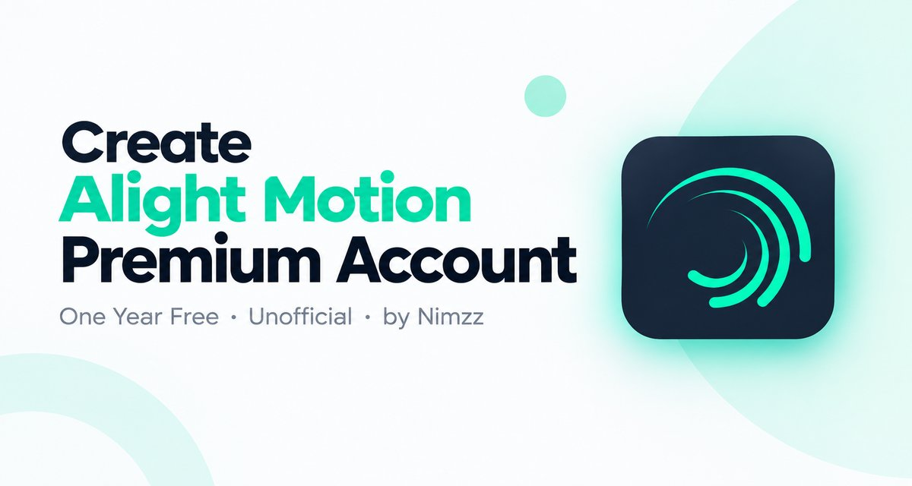

# Alight Motion Premium Creator (Next.js)

**Layanan gratis & unofficial** untuk aktivasi Alight Motion Premium, dibuat oleh **Hidaka401**.


> Gratis • Unofficial • Not for Resale — bukan produk resmi Alight Creative.

Hasil konversi dari versi React + TanStack Start (Vite) ke **Next.js 15 (App Router)**,
dengan tampilan (UI/UX) yang dipertahankan sama seperti versi asli, hanya dioptimasi agar
lebih ringan dan cepat (Next.js Image, code-splitting per-route otomatis, font & CSS
preload). Semua penyebutan "Nimzz" / "Nimzz AI" diganti menjadi **Hidaka401** / **Hidaka Ai**,
dan palet warna diperkaya (gradient ungu–teal–amber) agar tidak lagi terasa hanya putih/biru.

## Fitur & Halaman

| Route | Deskripsi |
|---|---|
| `/` | Landing page — ringkasan layanan, checklist syarat, quick FAQ |
| `/aktivasi` | Alur aktivasi 5 langkah (input email → kirim link → salin magic link → verifikasi → selesai) |
| `/panduan` | Panduan step-by-step lengkap dengan screenshot, untuk pemula |
| `/troubleshooting` | Solusi error umum: email tidak masuk, `INVALID_EMAIL`, `INVALID_OOB_CODE`, `EXPIRED_OOB_CODE`, `TOO_MANY_ATTEMPTS`, API offline, dll |
| `/faq` | Pertanyaan yang sering ditanyakan |
| `/status` | Cek status API (online/offline, versi, uptime) + info paket |
| `/sistem` | Penjelasan cara kerja sistem & alur data |
| `/donasi` | Donasi sukarela via QRIS + upload bukti transfer (dikirim ke Telegram) |
| `/api/hidaka-ai` | Endpoint chat streaming untuk asisten "Hidaka Ai" |

**Hidaka Ai** — chatbot bawaan (`HidakaAi.tsx`) yang fokus bantu user yang stuck (paling
sering di step "cari magic link di email"), dilengkapi filter kata kasar, filter
anti-jailbreak, dan rate limit per-IP.

## Tech Stack

- **Next.js 15** (App Router, Route Handlers, React Server Components)
- **React 19** + TypeScript
- **Tailwind CSS v4**
- **TanStack Query** (client-side data fetching status/info)
- **Radix UI** (accordion, dialog, label) + **Vaul** (drawer) + **Sonner** (toast)

## Instalasi

```bash
npm install
cp .env.example .env.local
npm run dev
```

## Environment Variables

Lihat `.env.example`:

- `API_BASE_URL` — URL backend API aktivasi (server-side saja, bukan secret). Default
  mengarah ke API demo lama; **ganti ke API kamu sendiri** kalau punya backend berbeda.
- `NEXT_PUBLIC_SITE_URL` — URL publik website ini (untuk canonical/OG/sitemap).
- `TELEGRAM_BOT_TOKEN`, `TELEGRAM_CHAT_ID` — SECRET, hanya diset di dashboard Vercel
  (Environment Variables), untuk terima bukti transfer donasi.

> Catatan: URL sosial media (`socialLinks`) di `src/config/site.ts` masih memakai akun
> lama. Ganti `href` di file itu ke akun kamu sendiri.

## Build & Deploy

```bash
npm run build
npm run start
```

Deploy paling mudah lewat [Vercel](https://vercel.com): import repo, isi Environment
Variables sesuai `.env.example`, lalu deploy.

## Struktur Folder

```
src/
  app/                      route Next.js App Router (tiap folder = 1 URL)
    api/                     route handlers (pengganti server function TanStack)
    aktivasi/ panduan/ ...   halaman
    layout.tsx               shell aplikasi (Navbar, Footer, BottomNav, Hidaka Ai)
    globals.css              tema warna & utility Tailwind
  components/
    site/                    komponen khusus halaman (ActivationFlow, HidakaAi, dst)
    ui/                      komponen dasar (button, input, dialog, dst)
  config/                    site.ts (branding/sosial), api.ts (endpoint API)
  lib/                       logika server (am-api.server.ts, donation.server.ts, ...)
  hooks/                     use-api-status.ts
```

## Catatan Keamanan

- Endpoint `/api/hidaka-ai` punya rate limit per-IP serta filter kata kasar & anti-jailbreak.
- Semua endpoint POST menolak request lintas-origin (`src/lib/security.ts`).
- Website tidak pernah menampilkan token, secret, atau credential internal apa pun.

## Disclaimer

Website ini merupakan layanan unofficial yang dibuat oleh **Hidaka401** dan bukan
merupakan website resmi Alight Motion atau Alight Creative. Layanan disediakan secara
gratis dan tidak untuk diperjualbelikan.

## Lisensi

Dibuat dengan ❤️ oleh **Hidaka401**.
